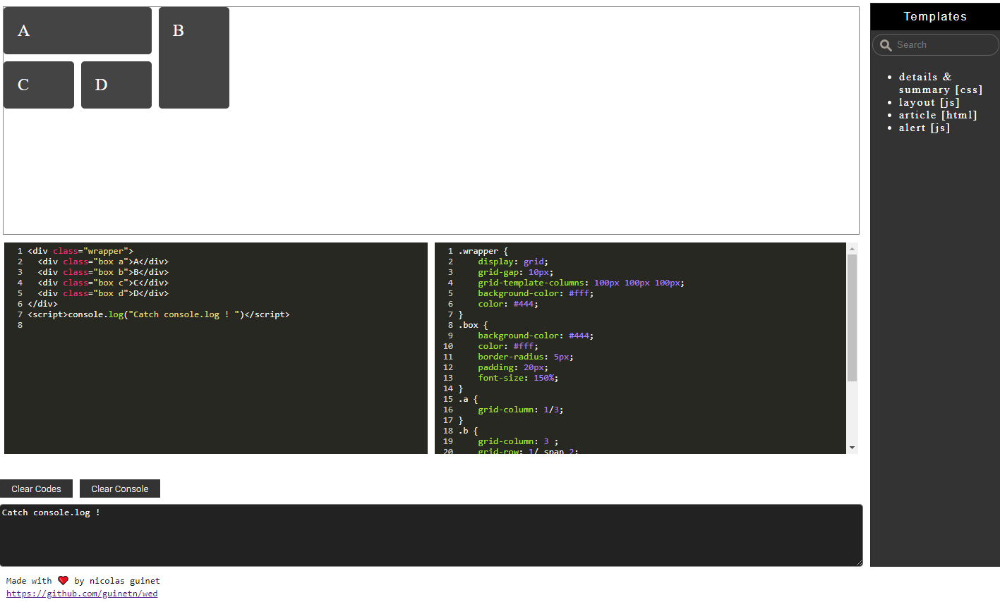

# wed
A web editor sided with editable samples for training/prototyping: <https://guinetn.github.io/wed> 

## Features
* Html/css/js editor   
* Realtime modifications rendering
* Console outputs catched and displayed
* Templates injection by simple click      
* Local storage to restore application state 

## Running Locally
>Open index.html  

Complexe templates (are html & css files) require a server  
- Ex: [LiveServer, a VSCode extension](https://marketplace.visualstudio.com/items?itemName=ritwickdey.LiveServer)  
- From VSCode  
> Open index.html  
> Click on status bar "Go live" or right-click on index.html → Open with LiveServer

<pre> <code>
+------------------+    +------------------+  
+   Render zone    +    +     TEMPLATES    +  
+------------------+    .                  .  
+------------------+  
+  Editable code   +  
+------------------+  
[Commands]    
+------------------+  
+  console output  +    .                  .  
+------------------+    +------------------+  
</code></pre>

# Templates

Defined in ***js\templates_list.js***  
Can be  
* a simple snippet (no server is required)
* an html and/or css page (then a server is required. LiveServer in vscode is enough)

# Development tools

* VSCode + LiveServer
* CodeMirror
