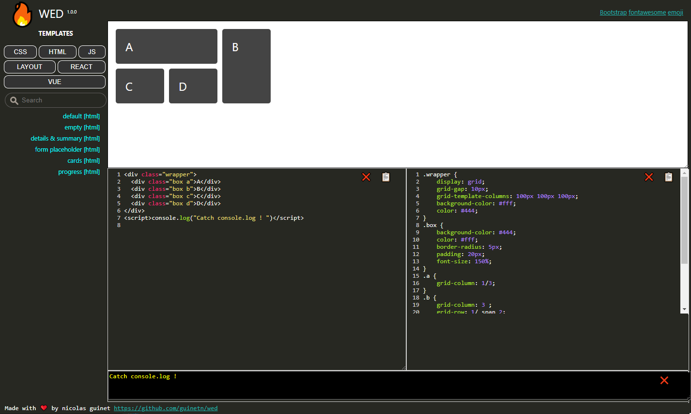

# wed
A web editor sided with editable samples for training/prototyping: <https://guinetn.github.io/wed> 

## Features

* Html/css/js editor (CodeMirror with SublimeText keymap)  
* Realtime rendering as you type 
* Categories of Templates
* Console.log/error/info outputs are catched and displayed  
* AutoSave. Startup will restore last application state (css and html code panel)  

## Setup

### Running online

Just deploy the folder on an http server

### Running locally: install a local server

* Using [**serve**](https://www.npmjs.com/package/serve) npm package
>npm i -g serve  
cd […project_path…]  
serve 

* Using [**LiveServer**](https://marketplace.visualstudio.com/items?itemName=ritwickdey.LiveServer) VSCode Extension  
>Open the project's folder in VSCode  
Open index.html  
Click on VSCode status bar "Go live" (right-click on index.html → Open with LiveServer)

## Create your own template

Templates are html+css files stored under /categories  
1. Add files (html, css, javascript) in a category 
2. Declare them inside the category's templates.json, ie: { "name": "details & summary", "lang": "html", "files": "details_summary.html" },  
    **name**      Template description. For display/filter purpose  
    **lang**      Type of the template: js, css, html. For display/filter purpose  
    **files**     Template content are in .html and/or .css files comma separated. Ignored if content is set  
    **content**   Raw template content (no files sided to it). If set, it will overrides files   
3. **`npm run build`** to generate categories/categories.js, a file used to display categories and their associated templates

## Tech stack

* Npm + NodeJS 16.15.1
* NPM package [serve](https://www.npmjs.com/package/serve)
* VSCode + Extensions: [LiveServer](https://marketplace.visualstudio.com/items?itemName=ritwickdey.LiveServer)
* [CodeMirror V5.65.6](https://codemirror.net/)
* FlexBox Layout

## Contributing

Wow, thanks to contribute to this project!   
New ideas, samples, forks...are welcome.  
So please just fork it, commit, push and send me a pull request to main.  

## Changelog

See [CHANGELOG](CHANGELOG.md) for more details.

## License

This project is licensed under the [MIT License](LICENSE)

---

*created by [Nicolas Guinet](https://github.com/guinetn/wed)*

